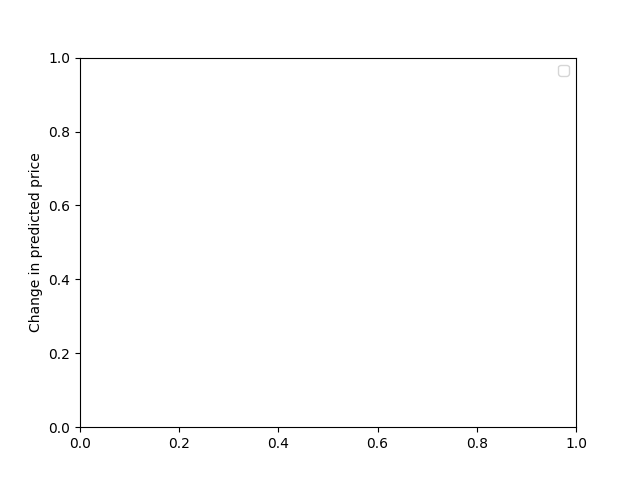

Cryptosapiens has been launched with an aim to enhance the performance of cryptocurrencies for the techie sapiens. It will provide investors with a complete outlook of the past, present and near future of the cryptocurrency market. It combines 3 actions in a single platform:
1. Provide past trend of different cryptocurrencies
2. Predict their future values
3. Evaluate the optimized time to invest and trade cryptos for maximum possible return in the user specified time period.

The supported cryptocurrencies are Bitcoin, Ethereum, Dogecoin, Tether, Litecoin and Ripple as of now.

